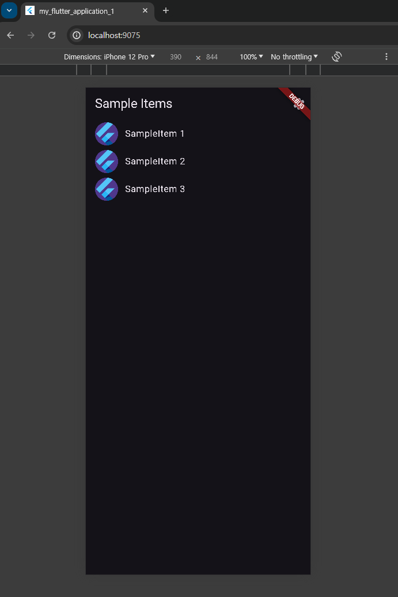

# Flutter를 이용한 앱 개발

- Flutter SDK 설치: Flutter 공식 홈페이지 참고
- Git for Windows 설치
- Android Studio 설치
- Android SDK 설정
- Flutter 와 Android Studio, VS Code 통합
- Flutter 설정 확인
- Flutter Project 생성 및 실행(Android Emulator or Android Device 사용)
- 

[jekyll-docs]: https://jekyllrb.com/docs/home
[jekyll-gh]:   https://github.com/jekyll/jekyll
[jekyll-talk]: https://talk.jekyllrb.com/